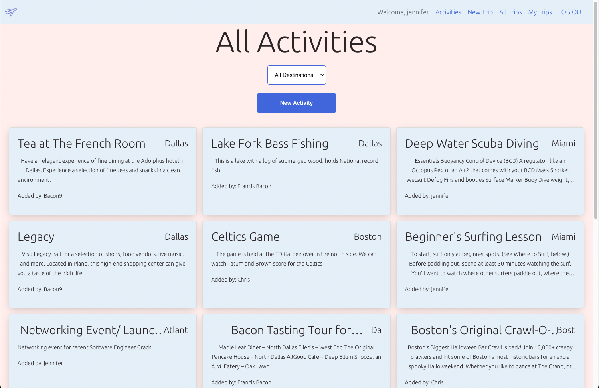

# Plan.e [🛫](https://wifi-travelers-plane.netlify.app)  

---
## About Plan.e 

---
## Table of Contents

>>  About Plan.e
> - Our Solution: Plan.e, A stress-free and collaborative application for travelers.
>> Table of Contents
>
>> Deloyment Link
>
>> Screenshots
>
>> Planning Materials
> - Trello Board  
> - Planning 

## Click the  [🛫](https://wifi-travelers-plane.netlify.app)   to get started 
---

## Screenshots Below 📸 ==>

## Plan.e Back-End Repository
### View back-end repo [here](https://github.com/thepika206/plane-back-end) 💡

## Planning Materials

### Trello Planning Board [here](https://trello.com/b/dML6GGmF/plane) 💡
### Planning diagram

### How to use our app 📋

> Welcome to Plan.e! A stress-free and collaborative app for travelers
> 
> To Get Started:
>
>1. If you are an existing member, log in to your account. If not, signup!
>
>2. Create a New Trip
>
>3. Browse through the activities for the respected destination of your trip
>
>4. Find an activity you like. Read more about it and whether or not other users liked it as well
>
>5. Want to add this activity to be a part of your trip? No problem, add it to your respected trip and Plan.e ahead of time
>
> Thank you for visiting our app. Cheers to safe and stress-free travels!

### Technologies Used 💻
 
> React

> HTML | CSS

> Javascript
 
> Express/NodeJS

> MongoDb with Mongoose

> Bootstrap

> 

### Credits ✒️

> [Patrick Cheung](https://github.com/thepika206)
>
> [Naveen Bhatti](https://github.com/mrunlockedtech-odin)
>
> [Chris Elliott](https://github.com/chriselliott97)
>
> [Jennifer Juarez](https://github.com/J3NNog1)
> 
> GA Engineering Channel
> 
> Starter Project Template from Ben and David.

### Ice Box ❄️

- [ ] AAU, I should be able to implement the group aspect of planning the trips. 

- [ ] AAU, I should filter activities based on age rating.

- [ ] AAU, when other users find your review helpful (helpful tag) - Lots of helpful tags give you a verification tag.

- [ ] AAU, I should be able to copy a pre-made travel plan into my account and modify it.
  
- [ ] AAU, I should be able to filter activity categories.
  
- [ ] AAU, I should be able to filter activities for my contributions.

- [ ] AAU, I want to see everyones profiles and where they have been.
  
- [ ] AA Admin, I should be able to add destinations to the site.
